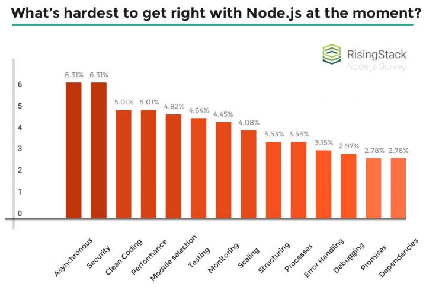

# 0. 이 책을 이용하는 방법

Async/await는 지난 15년 간 자바스크립트 규격에 적용된 단일 기능 중 가장 중요한 기능입니다. 일반적으로 "이벤트 루프"와 "비동기 프로그래밍"은 GUI와 Servers를 구축하는데 있어 매우 탁월합니다. 하지만 callback은 오류 처리를 지루하게 만들고, 코드는 읽기 어렵게 만들죠. 예를 들어, 2017년에 RisingStack은 Node.js 개발자들에게 무엇 때문에 고군분투 했는지 설문조사를 했는데, "비동기 프로그래밍"이 1위를 차지했습니다.



대부분의 경우, async/await는 비동기 코드를 동기식 코드처럼 깔끔하고 읽기 쉽도록 합니다. 헝클어진 promise chains과 복잡한 async 같은 ****사용자 라이브러리들은, 초급 junior 개발자도 쉽게 이해할 수 동기식 프로그래밍인 `for`**,** `if/else` 그리고 `try/catch`블럭을 사용해서 대체할 수 있습니다.

다음 코드는 \(JavaScript from a 2012 blog post\)은 자바스크립트에서 callbacks이 얼마나 잘못 활용되고 있는지 보여주는 전형적인 사례입니다. 이 코드는 작은 하지만 오류 처리를 위한 코드가 많고 흐름을 이해하기 어렵게 만드는 중첩된 `if`문을 포함하고 있습니다. 정신을 다잡는데 시간이 좀 걸리고, 적절한 오류 처리를 위해서 모든 callbacks에 `if (err != null)`을  복붙해야 합니다.\(Ctrl-C/Ctrl+V\)

```jsx
function getWikipediaHeaders() {
    // i. check if headers.txt exists fs.stat('./headers.txt', function(err, stats) {
    if (err != null) { throw err; } 
    if (stats == undefined) {
        // ii. fetch the HTTP headers
        var options = { host: 'www.wikipedia.org', port: 80 }; 
        http.get(options, function(err, res) {
            if (err != null) { throw err; }
                var headers = JSON.stringify(res.headers);
                // iii. write the headers to headers.txt fs.writeFile('./headers.txt', headers, function(err) {
                if (err != null) { throw err; }
                console.log('Great Success!'); });
            });
        } else { console.log('headers already collected'); }
    }); 
}
```

아래는 async/await 를 사용해서 동일한 처리를 수행하는 코드입니다. 이때, `stat(), get(), writeFile()`는 알맞게 promise 화 되어 있다고 가정합니다.

```jsx
async function getWikipediaHeaders() {
    if (await stat('./headers.txt') != null) {
        console.log('headers already collected'); 
    }
    const res = await get({ 
        host: 'www.wikipedia.org', 
        port: 80 
    }); 

    await writeFile('./headers.txt', JSON.stringify(res.headers)); 
        console.log('Great success!');
}
```

여러분은 await/async가 별거 아니라고 생각하거나, 심지어 좋지 않은 아이디어라고 생각할 수 있습니다. 사실 본인도 같은 입장이었습니다. 2013년 경,  async/await를 처음 접했을 땐 필요 없다고 생각했습니다. 하지만 generators 기반의 coroutines\( async/await의 2015년 이전 버전 \)을 사용하기 시작했을 무렵, `TypeError: Cannot read property 'x' of undefined` 오류와 함께 서버가 순식간에 뻗는 것을 보고 충격을 받았습니다. 2017년 await/async가 자바스크립트 언어 규격의 일부가 되었을 때, 저에게 await/async는 실전 개발에 없어서는 안 될 중요한 부분이 되었습니다.

이제 async/await가 공식적으로 자바스크립트의 일부라고 해서 세상이 온통 장미빛 무지개라는 것을 의미하지는 않습니다. async/await가 일상적인 개발을 더 쉽게 할 수 있도록 보장하는 새로운 기법은 맞지만, 다른 것들과 마찬가지로 우선 이해가 필요하며 그렇지 못할 경우, 득보다는 실이 더 많습니다. 별 생각 없이 stackoverflow에 실린 답변들로 오려 붙인 async/await 코드들 이라면, 단순히 _**callback hell**_이 _**async/await hell**_로 바뀐 것 뿐입니다.

이 책의 목표는 promise와 async/await에 대한 어설픈 이해를 벗어나, 복잡한 핵심 로직을 a_sync/await_ 기반으로 손쉽게 작성하고 디버깅 할 수 있도록 안내하는 것입니다. 이 책은 52페이지 정도에 불과하며 총 2시간 정도 읽어볼 수 있는 분량입니다. 한 자리에서 다 읽을 수도 있겠지만, 한 번에 한 장씩 읽고 각 장 마지막에 있는 연습 문제를 공부하세요. 다음으로, 그 지식을 채득하기 위해 장 사이에서 숙면을 취하는 것이 좋을 것 같습니다.

이 책은 크게 4장으로 구분됩니다. 각 장은 12 페이지 정도이며, 말미에는 해당 장에서 얻게되는 주요 교훈을 강조하기 위한 연습 문제가 있습니다. 코딩보다는 생각을 더 많이 필요로 하지만 몇 분 내에 쉽게 대답할 수 있을 것입니다.

첫 3장은 promise와 async/await의 기초에 주안점을 두었으며, 개발 프레임워크나 외부 의존성을 피하기 위해 노력하였습니다. 샘플 코드과 연습 문제는 특별히 Node.js 8.x에서 실행하였으며 Babel과 같은 트랜스파일러\(코드 변환기\)는 사용하지 않았습니다.

현실적인 사례를 위해 샘플 코드의 HTTP Requests는 `superagent` 모듈을 활용했습니다. 4장에서는 async/await와 몇 가지 공통 npm 모듈을 통합하는 방법에 대해 논의합니다.

샘플 코드나 연습 문제에 문제점이 있다면 아래 주소로 알려주세요. [http://github.com/vkarpov15/mastering-async-await-issues](https://github.com/vkarpov15/mastering-async-await-issues/issues)

자! 그럼 async/await 를 마스터할 준비가 되셨습니까? 시작합시다!

