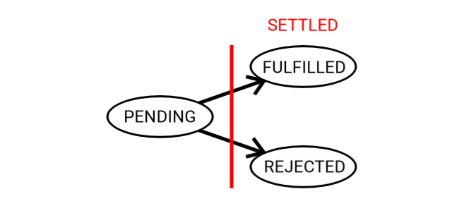

# 2. 원점에서 시작하는 Promises

async/await는 promise를 바탕으로 만들어졌습니다. async 함수는 promise를 반환하며, `await`은 promise를 대상으로 작동할 때, 해당 async 함수를 일시 정지 시킵니다. async/await 내부를 이해하기 위해서는 기본 원칙들로 부터 promise가 어떻게 작동하는지 이해할 필요가 있습니다. 자바스크립트의 promise는 우연히 나타난 것이 아니라, async/await 같은 패러다임이 가능하도록 세심하게 설계되었습니다.

ES6 규격에서, promise는 하나의 클래스이며 그 생성자는 `executor`함수\(초기 함수\)를 인수로 갖는다고 되어 있습니다. Promise 클래스의 인스턴스는 `then()` 함수를 멤버 함수로 가지고 있습니다. ES6 규격의 promise는 몇 가지 다른 속성들도이 있지만, 일단 이해의 편의를 위해 무시하기로 합니다. 아래는 단순화된 promise 클래스의 골격을 보여줍니다.

```jsx
// example 2.1

class Promise {
    // executor는 두 개의 파라미터를 받습니다; resolve(), reject()
    //    executor 함수는 async 함수가 성공 또는 실패인 경우 그에 대응되는 
    //    resolve()나 reject()를 호출할 책임이 있습니다.
  constructor(executor) {}

  // promise가 성공적으로 이행됐으면 onFulfilled가 호출되며,
  //   실패면 경우 onRejected가 호출됩니다. 
  // 당분간 여러분은 fulfilled와 resolved를 같다고 생각할 수 있습니다. 
  then(onFulfilled, onRejected) {}
}
```

promise는 3가지 상태를 갖는 상태 기계입니다.

* pending\(보류\): 초기 상태이며, 현재 내부 작업\(코드\)이 수행 중인 상태입니다.
* fulfilled\(이행\): 내부 작업이 성공적으로 수행되었으며 연관된 결과값을 가지고 있는 상태입니다.
* rejected\(실패\): 내부 작업이 실패하였고 그와 연관된 오류값을 가지고 있는 상태입니다.

pending 상태가 아닌 promise는 "정착 상태:settled"라고 불립니다. 다른 말로 정착한 promise는 "이행"과 "실패" 중 하나의 상태가 됩니다. 일단 promise가 정착되면 다른 상태로 바꿀 수 없습니다. 예를 들어, 아래 promise는 `reject()`를 호출 했음에도 불구하고 "이행" 상태로 남게 됩니다. 일단 `resolve()` 또는 `reject()`가 호출되면 다른 `resolve(), reject()` 호출은 아무 영향을 미치지 못합니다. 이런 세밀한 부분이 async/await의 핵심인데, async 함수 종료 후, promise가 "이행" 상태에서 "실패" 상태로 바뀐다고 했을 때, 어떻게 await가 동작할 것인가?라는 점 때문입니다.

```jsx
// example 2.2

const p = new Promise((resolve, reject) => {
  resolve("foo"); 
  // The below `reject()` is a no-op. A fulfilled promise stays
  // fulfilled with the same value forever.
  reject(new Error("bar"));
});
```

다음은 promise 상태기 계를 보여주는 그림입니다.



위 그림을 염두에 두고, 상태 전이를 구현한 promise 생성자의 첫번째 초안을 아래에서 살펴보겠습니다.

아래 사용된 속성들의 이름들; `state, resolve, reject` 그리고 `value`은 표준이 아님을 유념해 주세요. 실제 ES6 promise는 이들 속성들을 공개적으로 노출하지 않습니다. 따라서 자바스크립트 promise p로 `p.value, p.resolve` 등과 같이 사용하지 마세요.

```jsx
// example 2.4

class Promise {
  constructor(executor) {
    this.state = "PENDING";
    this.chained = []; // 아직 사용하지 않습니다.
    this.value = undefined;
    try {
      // 초기함수(executor)에 동기 오류가 있으면 reject 호출  
      executor(
        (v) => this.resolve(v),
        (err) => this.reject(err)
      );
    } catch (err) {
      this.reject(err);
    }
  } 

    // promise 상태를 바꾸는 resolve(), reject()를 정의합니다.
  resolve(value) {
    if (this.state !== "PENDING") return;
    this.state = "FULFILLED";
    this.value = value;
  }
  
  reject(value) {
    if (this.state !== "PENDING") return;
    this.state = "REJECTED";
    this.value = value;
  }
}
```

promise 생성자는 promise의 상태를 처리하고 초기 함수\(`executor()` 함수\)를 호출합니다. promise가 정착할 때 동작할 핸들러를 사용자들이 정의할 수 있도록 여러분은 `then()` 함수를 구현해야 합니다. `then()`은 2개의 함수, `onFulfilled()`와 `onRejected()`를 인수로 가집니다. promise는 자신이 "이행" 상태라면 `onFulfilled()`를, "실패" 상태라면 `onRejected()`를 반드시 호출해야 합니다.

현재 then\(\) 함수는 단순합니다. 인수로 넘겨진 `onFulfilled(), onRejected()`를 chained 배열에 추가하겠습니다. 그러면 promise가 "이행: fulfilled"또는 "실패: rejected" 상태가 되었을 때, `resolve()` 또는 `reject()` 가 그들을 호출\(ES6 규격에 의해 이벤트 루프의 다음 tick에서 처리됩니다.\) 합니다. 만약 promise가 이미 "정착" 상태라면 `then()`함수는 `onFulfilled()` 또는 `onRejected()`가 이벤트 루프의 다음 tick에 호출되도록 이벤트 큐에 넣습니다.\( setImmediate\(\) \)

```jsx
// example 2.5

class Promise {
  // .....
  // 생성자는 이전과 같습니다. 간략하게 하기위해 생략합니다.
  
  then(onFulfilled, onRejected) {
    const { value, state } = this; 

    // promise가 이미 "정책" 상태라면 그 상태에 맞는 핸들러를 호출합니다.
    //   - 다음 tick에서 실행
    if (state === "FULFILLED") return setImmediate(onFulfilled, value);
    if (state === "REJECTED") return setImmediate(onRejected, value); 

    // "PENDING" 상태면 나중에 실행될 수 있도록 두 핸들러를 보관합니다.
    this.chained.push({ onFulfilled, onRejected });
  }
  
  resolve(value) {
    if (this.state !== "PENDING") return;
    
    Object.assign(this, { value, state: "FULFILLED" }); 

    // chained에서 onFulfilled()를 찾습니다.
    //   .then(null, onRejected)은 정상 호출임을 기억하세요.
    this.chained
      .filter((obj) => obj.onFulfilled instanceof Function) 
      // ES6 규격 섹션 25.4에 따라,
      //  "onFulfilled","onRejected"는 반드시 이벤트루프의 다음 tick에서 호출해야 합니다.
      .forEach((obj) => setImmediate(obj.onFulfilled, value));
  }
  
  reject(value) {
    if (this.state !== "PENDING") return;

    Object.assign(this, { value, state: "REJECTED" });
    this.chained
      .filter((obj) => obj.onRejected instanceof Function)
      .forEach((obj) => setImmediate(obj.onFulfilled, value));
  }
}
```

위 `Promise` 클래스는 단순하지만 async/await와 통합하는데 필요한 대부분의 작업을 표현하고 있습니다. `await` 키워드는 자신이 다루는 값이 `instance of Promise`인지 명확히 검사하지는 않으며, 오직 `then()` 함수의 존재 만을 검사합니다. 일반적으로 자바스크립트는 `then()`함수를 가지는 모든 객체를 _**thenable**_ 이라 부릅니다. 다음은 await/async와 동작하는 맞춤형 `Promise` 클래스를 사용하는 사례입니다.

```jsx
// example 2.6

async function test() {
  // Works, even though this is a custom `Promise` class. All
  // you need is a `then()` function to support `await`.
  const res = await new Promise((resolve) => {
    setTimeout(() => resolve("Hello"), 50);
  });
  assert.equal(res, "Hello");
}
```

## Promise Chaining: promise 연결

지금까지 Promise 구현이 지원하지 않는 중요한 특징 중 하나는 Promise Chains입니다. generator와 async/await가 광범위하게 지원됨에 따라 지금은 잘 사용하지 않지만, Promise chains은 비동기 코드를 반듯하게 유지하기 위한 일반적인 패턴입니다.\( 계단 형태로 보이는 중첩 callbacks 보다는 일차원적인 모습으로 보이는 형태 \) 서론에서 나왔던 `getWikipediaHeaders()`함수가 Promise chains을 통해 어떻게 보일지 아래를 살펴봅시다.

```jsx
// example 2.7

function getWikipediaHeaders() {
  return stat("./headers")
    .then((res) => {
      if (res == null) {
        // onFulFiiled()에서 promise를 반환하면, 다음 then() 호출의 onFulFilled()는 
        // 반환된 promise가 fulfilled 상태가 될 때 호출됩니다.
        return get({ host: "www.wikipedia.org", port: 80 });
      }
      return res;
    })
    .then((res) => {
      // 위 onFulFilled()가 기본형 값 또는 promise를 반환함에 따라서
      // 이번 onFulfilled()는 headers 객체를 가지게 됩니다. 
      return writeFile("./headers", JSON.stringify(res.headers));
    })
    .then(() => console.log("Great success!"))
    .catch((err) => console.err(err.stack));
}
```

async/await 방식이 우수하지만 promise chains도 여전히 유용하며, 탄탄한 promise 구현을 위해서도 여전히 필요합니다. promise chains을 구현하려면 example 2.5의 promise 구현에서 3가지 수정이 필요합니다.

1. `then()` 함수는 promise를 반환합니다. `then()`에서 반환된 promise는 `onFulfilled()`에서 반환된 값으로 이행되어야 합니다.
2. `resolve()` 함수는 `value`가 thenable 인지 검사할 필요가 있는데,  맞다면 fulfilled 또는 rejeced로 상태 전이가 이루어지는 것은 `value`가 fulfilled 또는 rejected 로 상태가 바뀔 때 입니다.
3. 만약 thenable 객체에 `resolve()` 함수가 호출된다면, promise는 'PENDING" 상태에 머물어야 합니다. 하지만 이후에 resolve\(\), rejected\(\) 호출은 무시되어야 합니다.

```jsx
// example 2.8

then(_onFulfilled, _onRejected) {
    // `onFulfilled` is a no-op by default...
    if (typeof _onFulfilled !== "function") _onFulfilled = (v) => v; 
    // and `onRejected` just rethrows the error by default
    if (typeof _onRejected !== "function") {
      _onRejected = (err) => {
        throw err;
      };
    }
    
    return new Promise((resolve, reject) => {
      // onFulfilled과 onRejected를 도우미 함수로 깜싸는 이유는 2가지:
      // 일관된 async과 try/catch 코드를 위해서이다. 그래야 지저분한 if 검사들이 줄듭니다.
      const onFulfilled = (res) =>
        setImmediate(() => {
          try {
            resolve(_onFulfilled(res));
          } catch (err) {
            reject(err);
          }
        });
      const onRejected = (err) =>
        setImmediate(() => {
          try {
            // 여기는 resolve임을 주목하세요. reject가 아닙니다. 
            // then() promise는 onRejected가 rethrow 하지 않으면 이행 상태가 됩니다.
            resolve(_onRejected(err));
          } catch (err) {
            reject(err);
          }
        });
      const { state } = this;
      if (state === "FULFILLED") return onFulfilled(this.value);
      if (state === "REJECTED") return onRejected(this.value);
      this.chained.push({ onFulfilled, onRejected });
    });
}
```

`then()`은 promise를 반환합니다. 하지만 여전히 마쳐야 할 작업이 있습니다: `onFulfilled()` 가 promise를 반환하면 `resolve()`가 그 promise를 다룰 수 있어야 합니다. 이를 위해 `resolve()`는 `then()`을 2단계 재귀를 이용해야 합니다. 아래는 두 번째 필요한 수정을 보여줍니다.

```jsx
// example 2.9

resolve(value) {
    if (this.state !== "PENDING") return;
    if (value === this) {
      return this.reject(TypeError(`Promise resolved to itself`));
    } 
    // value가 thenable이면, value가 fulfilled 또는 rejected될 때 이 promise를 
    //   fulfill/reject 합니다. Promises/A+ 규격은 이것을 다른 promise를 
    // 'assimilating'이라 부릅니다.
    const then = this._getThenProperty(value);
    if (typeof then === "function") {
      try {
        return then.call(
          value,
          (v) => this.resolve(v),
          (err) => this.reject(err)
        );
      } catch (error) {
        return reject(error);
      }
    } 
    
    // value가 thenable이 아니면 그냥 fulfilled가 된다.
    this.state = "FULFILLED";
    this.value = value;
    this.chained.forEach((obj) => setImmediate(obj.onFulfilled, value));
}

// then 속성을 얻는 도무미 함수입니다. Promises/A+는 2가지 교묘한 세부사항이 있습니다.
//   then은 한번만 접근할 수 있고 value.then이 오류를 내면 그 promise는 reject됩니 
_getThenProperty(value) {
    if (value == null) return null;
    if (!["object", "function"].includes(typeof value)) return null;
    try {
      return value.then;
    } catch (error) {
      // 내키진 않지만, Promises/A+ section 2.3.3.2에사 규정하고 있다.
      this.reject(error);
    }
}
```

마지막으로, 세 번째 수정은 thenable에서 `resolve()`가 일단 호출된 후에는 promise는 상태를 바꾸지 않도록 하는 것입니다. `resolve()`, promise 생성자 둘 다 수정이 필요합니다. 이 수정은 아래 예제에서 `p2`가 이행 상태 상황에서 실패 상태가 안되도록 하기 위해서 입니다.

```jsx
// example 2.10

const p1 = new Promise((resolve) => setTimeout(resolve, 50));
const p2 = new Promise((resolve) => {
  resolve(p1);
  throw new Error("Oops!"); // 무시됩니다, promise는 이미 resolve 됐습니다.
});
```

이를 위해, `resolve(), reject()`가 오직 한번만 수행될 수 있도록 `this.resolve()`와 `this.reject()`를 감싸는 helper 함수를 만들어 봅시다.

```jsx
// example 2.11

// promise가 아직 대기 상태에서, resolve()를 호출하면 
//  이후 resolve, reject 호출은 무시됩니다.
_wrapResolveReject() {
  let called = false;
  const resolve = (v) => {
    if (called) return;
    called = true;
    this.resolve(v);
  };
  const reject = (err) => {
    if (called) return;
    called = true;
    this.reject(err);
  };
  return { resolve, reject };
}
```

도우미 함수를 가졌다면, 이제 resolve\(\) 내부에서 이를 호출해야 합니다.

```jsx
// example 2.12

resolve(value) {
  // ...
  if (typeof then === "function") {
    // then이 PENDING promise에 resolve를 호출하고 이어서 throw해도 example 2.10처럼
    // fulfill 상태가 됩니다
    const { resolve, reject } = this._wrapResolveReject();
    try {
      return then.call(value, resolve, reject);
    } catch (error) {
      return reject(error);
    }
  } // ...
}
```

또한, constructor 내부에서 도우미 함수 `_wrapResolveReject()`를 사용해야 합니다.

```jsx
// example 2.13

constructor(executor) {
  // 전반부는 생략합니다~
  // ...
  // example 2.10 상황을를 처리합니다.
  const { resolve, reject } = this._wrapResolveReject();
  try {
    executor(resolve, reject); 

    // executor가는 resolve 호출하고 나서 오류를 발생시켰기 때문에,
    //  아래 reject()는 영향을 미치 않습니다. 
  } catch (err) {
    reject(err);
  }
}
```

이 모든 수정을 통해,  완전한 promise 구현체를 만들게 되었습니다. 이는 [bit.ly/simplepromise](https://gist.github.com/vkarpov15/169d61f210c3420accf96f2081ad716d)에서 찾을 수 있는 Promises/A+ 규격에 포함된 872개의 모든 시험 항목을 만족합니다. Promises/A+ 규격은 ES6 promise 규격에서 `then()`와 promise 생성자 부분에 집중한 하위 규격입니다.

## catch\(\)와 다른 도우미들

ES6 promise 규격은 Promises/A+ 규격의 상위 규격이며, `then()` 함수 부분과 편리한 몇몇 도우미 메서드를 더한 것입니다. 가장 일반적으로 사용되는 도우미 함수는 `catch()` 함수입니다. 동기적인 `catch` 키워드와 같이, 전형적으로 `catch()` 함수는 일어날 수 있는 모든 오류 들을 다룰 수 있도록 promise chains의 마지막 부분에 나타납니다.

`catch()` 함수는 다소 복잡해 보이지만, `then()`을 살짝 덧쒸운 것에 지나지 않습니다. `catch()`함수는 catch\(\)라는 이름 자체가 갖는 역할적 의미가 너무 분명합니다. 아래는 catch\(\)의 전체 구현입니다!

```jsx
// example 2.14

catch(onRejected) {   
    return this.then(null, onRejected); 
}
```

이게 왜 효과가 있는 걸까요? example 2.8에서 `then()`이 `onRejected()`함수를 기본 인수로 가지다는 것은 떠올려 보세요. `onRejected()`는 오류를 rethrow 합니다. 따라서 promise가 실패가 될 때, onFulfilled\(\) 만 수행하는 후속적인 then\(\) 호출들은 모두 건너뛰게 되는 것입니다.

```jsx
// example 2.15

const originalError = new Error("Oops!");
const p = new Promise((_, reject) => reject(originalError))
  .then(() => console.log("This will not print"))
  .then(() => console.log("Nor will this")) 
  // onFulfilled()들은 계속 지나치고, 
  //   위 then() promise 각각은 originalError로 reject합니다.
  .catch((err) => assert.ok(err === originalError));
```

ES6 promise 규격에는 몇 가지 도우미 함수들이 있습니다. `Promise.resolve(), Promise.reject()`는 모두 테스트와 예제들에서 보편적으로 사용될 뿐 아니라. thenable을 완벽한 promise로 바꾸기도 합니다.

```jsx
// example 2.16

// 네. 이것은 theable입니다. promise에 관한 한, 법조문이 법의 정신을 무시하는 듯 합니다. 
const thenable = {
  then: () => {
    throw Error("Oops!");
  },
};

// 하지만 thenable은 catch()를 갖지 못해서 catch()을 이용할 수 있도록 
//    Promise.resolve()로 바꿨습니다.
const p = Promise.resolve(thenable).catch((err) => console.log(err.message)); // Prints "Oops!"
```

다음은 `resolve(), reject()`의 구현 코드입니다.

```jsx
// example 2.17

static resolve(v) {
  return new Promise((resolve) => resolve(v));
}

static reject(err) {
  return new Promise((resolve, reject) => reject(err));
}
```

`Promise.all()`은 또 다른 중요 도우미 함수입니다. 여러 promises를 병렬로 수행하도록 하며 그 결과를 `await` 할 수 있게 합니다. 아래 코드는 두 개의 `run()` 함수 개체를 병렬로 수행하며 그 둘이 수행을 마칠 때까지 대기합니다.

```jsx
// example 2.18

async function run() {
  await new Promise((resolve) => setTimeout(resolve, 50));
  console.log("run(): running");
  await new Promise((resolve) => setTimeout(resolve, 50));
  console.log("run(): done");
}

console.log("Start running");
await Promise.all([run(), run()]);
console.log("Done"); 

// Start running
// run(): running
// run(): running
// run(): done
// run(): done
// Done
```

`Promise.all()`은 async 함수들을 병렬로 실행하기 위해 선호하는 방법입니다. async\(\) 함수들을 순차적으로 실행하기 위해, `for` 루프를 사용하거나 각 async\(\) 함수에 `await` 을 수행하곤 합니다.

`Promise.all()`은 promise 배열에 대해 then\(\)을 호출하는 편리한 도우미 함수이기도 합니다. 아래는 `Promise.all()`의 단순화된 구현체입니다.

```jsx
// example 2.19

function all(arr) {
  let remaining = arr.length;

  if (remaining === 0) return Promise.resolve([]); 
  
  // `result` stores the value each promise is fulfilled with
  // results에는 각 promise 들의 이행값이 저장됩니다.
  let result = [];
  return new Promise((resolve, reject) => {
    // 배열의 각 prommise 요소들에 대해 then() 함수를 호출합니다. 
    //   promise가 이행되면 값은 result에 저장합니다. 실패한 promise가 있다면 all() promise는 즉각
    //   reject 하여 처리를 중단한다.
    arr.forEach((p, i) =>
      p.then(
        (res) => {
          result[i] = res;
          --remaining || resolve(result);
        },
        (err) => reject(err)
      )
    );
  });
}
```

ES6 규격에는 도우미 함수가 하나 더 있습니다. 연습 문제로 남겨둘 `Promise.race()` 입니다. `race()` 와 서브 클래싱 지원 같은 일부 사소한 세부 사항 외에, 이 장의 promise 구현은 ES6 규격에 부합합니다. 다음 장에서는 promise에 대한 이해를 활용하여 async/await를 뜯어보고 내부적으로 어떻게 동작하는 지를 알아볼 것입니다.

처음부터 promise 라이브러리를 구축해 본 이번 과정의 핵심 교훈은 다음과 같습니다.

* Promise는 3가지 상태 중 한 상태를 가집니다. 대기\(pending\), 이행\(fulfilled\), 실패\(rejected\).  여러분이 `resolve(promise)`를 호출하면, 또 다른 promise의 상태를 맞추기 위해 promise는 잠길 수 있습니다.
* 일단 promise가 정착되면 동일 값으로 계속 상태를 유지합니다.
* `then()` 함수와 promise 생성자는 다른 모든 promise  함수들의 기본이 됩니다. `catch(), all(), resolve(), reject()`함수들 모두 then\(\)과 생성자를 이용한 간소화된 함수들일 뿐입니다.

async/await의 내부를 더욱 심층적으로 파악해보기에 앞서, promise에 대한 여러분의 이해를 더욱 확장시켜줄 예제 2개가 있습니다.

## Exercise 1: Promise Chains in Action, 실전의 promise chains

이번 예제는 promise chains을 편안하게 사용할 수 있도록 하는데 목적이 있습니다. promise chains은 async/await가 나온 상황에서는 그리 유용하진 않지만, `forEach()`와 `filter()`를 연결하면서 배열 변환을 처리하는데 유용한 것 처럼 async/await의 훌륭한 보완재가 되기도 합니다.

Example 1.1 같은 접속 주소를 사용해서, "Unhandled Promise Rejections in Node.js" 제목의 블로그 포스트를 찾고 그 내용을 가져오고, 그 `본문`에 "async/await" 구문이 몇 번이나 나오는지 찾아보세요.

아래는 API 접속 주소입니다. API 접속 주소는 구글 클라우드에 호스팅 되어 있으며 주소는 [https://us-central1-mastering-async-await.cloudfunctions.net/](https://us-central1-mastering-async-await.cloudfunctions.net/) 입니다.

* /posts gets a list of blog posts. Below is an example post
* /posts : 블로그 포스트의 리스트를 가져옵업니다. 아래는 포스트 예입니다.

```jsx
{
  src: "./lib/posts/20160304_circle_ci.md",
  title: "Setting Up Circle CI With Node.js",
  date: "2016-03-04T00:00:00.000Z",
  tags: ["NodeJS"],
  id: 51,
};
```

* /post?id=${id}: id값에 해당하는 블로그 포스트의 markdown 본문을 가져옵니다. 위 블로그 포스트의 id는 0입니다. 그래서 [https://us-central1mastering-async-await.cloudfunctions.net/post?id=0](https://us-central1mastering-async-await.cloudfunctions.net/post?id=0) 접속으로 본문을 가져올 수 있습니다. 브라우저로 위 주소에 접속하면 아래와 같은 출력을 볼 수 있습니다.

```jsx
{
    "content":"*This post was featured as a guest blog post..."
}
```

다음은 초기 코드입니다. 이 코드를 복사하고 node-fetch npm 모듈을 사용해서 node.js에서 실행해 보세요. 또는 CodePen at [http://bit.ly/async-await-exercise-21](http://bit.ly/async-await-exercise-21)에 브라우저로 접속해서 이번 예제를 완성해 볼 수도 있습니다.

```jsx
const root =
  "https://" + "us-central1-mastering-async-await.cloudfunctions.net";
function run() {
  // Example of using `fetch()` API
  return fetch(`${root}/posts`)
    .then((res) => res.json())
    .then((posts) => console.log(posts[0]));
}
run().catch((error) => console.error(error.stack));
```

## Exercise 2: Promise.race\(\)

ES6 promise규격에는 아직 이 책에서 다루지 못한 도우미 함가 있습니다. `Promise.rall()`와 같이 `Promise.race()`는 promise 배열을 인수로 받지만 `Promise.race()`는 처음 정착된 하나의 promise가 해결하거나 실패한 값을 반환합니다.

```jsx
const p1 = new Promise((r) => setTimeout(() => r(1), 50));
const p2 = new Promise((r) => setTimeout(() => r(2), 250)); 

// Prints "1", because `p1` resolves first
// p1이 먼저 이행 상태가 되기 때문에 "1"을 출력합니다.
Promise.race([p1, p2]).then((res) => console.log(res));
```

promise 배열이 주어지고, promise 배열의 한 요소가 정착 하자마자 이행 또는 실패로 정착된 promise의 값을 반환하는 `race()` 함수를 구현해 보세요. 힌트: 일단 한 promise가 정착하면 `resolve()` 또는 `reject()` 호출은 아무 영향이 없다는 점을 기억하세요.

다음은 초기 코드입니다. 이 코드를 복사하고 node-fetch npm 모듈을 사용해서 node.js에서 실행해 보세요. 또는 CodePen at [http://bit.ly/async-await-exercise-22](http://bit.ly/async-await-exercise-21)에 브라우저로 접속해서 이번 예제를 완성해 볼 수도 있습니다.

```jsx
function race(arr) {
  return Promise.reject(new Error("Implement this function"));
}

// The below tests help you check your `race()` implementation
test1()
  .then(test2)
  .then(() => console.log("Done!"))
  .catch((error) => console.error(error.stack));

function test1() {
  const p1 = new Promise((r) => setTimeout(() => r(1), 10));
  const p2 = new Promise((r) => setTimeout(() => r(2), 100));
  const f = (v) => {
    if (v !== 1) throw Error("test1 failed!");
  };
  return race([p1, p2]).then(f);
}

function test2() {
  const error = new Error("Expected error");
  const p1 = new Promise((r) => setTimeout(() => r(1), 100));
  const p2 = new Promise((r) => setTimeout(() => r(2), 100));
  const p3 = new Promise((resolve, reject) => reject(error));
  return race([p1, p2, p3]).then(
    () => {
      throw Error("test2: race() promise must reject");
    },
    (e) => {
      if (e !== error) throw Error("test2: wrong err");
    }
  );
}
```

