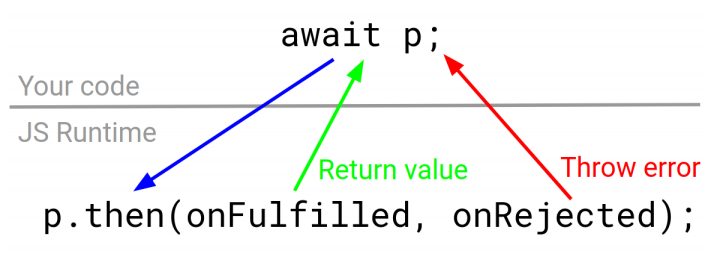

# 3. Async/await Internals

promise는 async/await와 통합을 위한 기본적인 수단입니다. promise가 어떻게 작동하는지 원점부터 알아보았으니 이제 시야를 넓혀서 promise에 `await`을 적용할 때 어떤 일이 일어나는지 살펴봅시다. 비록 async 함수가 동기식 함수와 유사하게 보이지만, 그 이면은 callbacks으로 가득 채워진 자바스크립트 코드처럼 비동기적 입니다. 이미 짐작하겠지만, `await`은 자바스크립트로 하여금 내부적으로 `then()` 함수를 호출하도록 합니다.

```jsx
// example 3.1

const p = {
  then: (onFulfilled) => {
    // 다은은 "then(): function () { [native code] }"를 출력합니다.
    console.log("then():", onFulfilled.toString()); 
    
    // 오류 스택에는 한가지 엔트리면 나옵니다.
    // Error
    //     at Object.then (/examples/chapter3.test.js:8:21)
    console.log(new Error().stack);
    onFulfilled("Hello, World!");
  },
};
console.log(await p); // "Hello, World!"를 출력합니다.
```

`await` 키워드는 자바스크립트로 하여금 이벤트 루프의 다음 차례까지 실행을 일시 정지 시키도록 합니다. 아래 코드에서 await 이후, `console.log()`는 `++currentId` 코드 뒤에 실행됩니다.

```jsx
// example 3.2

const startId = 0;
let currentId = 0;

process.nextTick(() => ++currentId);

const p = {
  then: (onFulfilled) => {
    console.log("then():", currentId - startId); // "then(): 1"
    onFulfilled("Hello, World!");
  },
};

console.log("Before:", currentId - startId); // "Before: 0"
await p;
console.log("After:", currentId - startId); // "After: 1"
```

비록 `then()`이 완전 동기식이라도 다음 차례에 작동된다는 점을 유의하세요. 이것은 `await`는 최소한 다음 차례까지는 실행을 일시 정지 시킨다는 것을 뜻합니다. 만약 `onRejected(err)`를 호출한다면 `await` 키워드는 여러분 함수 본체로 `err`를 throws합니다.

```jsx
// example 3.3

const startId = 0;
let currentId = 0;

process.nextTick(() => ++currentId);

const p = {
  then: (onFulfilled, onRejected) => {
    console.log("then():", currentId - startId); // "then(): 1
    return onRejected(Error("Oops!"));
  },
};

try {
  console.log("Before:", currentId - startId); // "Before: 0"
  await p;
  console.log("This does not print");
} catch (error) {
  console.log("After:", currentId - startId); // "After: 1"
}
```

## await vs return

async 함수에서 `return`은 그 함수가 반환하는 promise를 "해결" 한다는 것을 기억하세요. 이것은 여러분이 promise도를 `return` 할 수 있다는 것을 뜻합니다. `await`와 `return`의 차이점은 무었을까요? 답은 이렇습니다. promise에 `await` 할 경우, 자바스크립트는 그 async 함수의 실행을 일 시정지시킨 후에 재개시키지만, promise를 `return` 한다면 그 async 함수의 수행을 종료해 버리고 return된 함수를 재개하지 않습니다.

답은 분명 맞지만, `await` 가 어떻게 작동하는지 알아내기에는 의미가 좀 함축적입니다. 여러분이 `await p`를 `try/catch`로 감싸고 `p`를 "거절" 처리하면 error를 catch할 수 있습니다. 그대신 `return p` 한다면 어떨까요?

```jsx
// example 3.4

async function test() {
  try {
    return Promise.reject(new Error("Oops!"));
  } catch (error) {
    return "ok";
  }
} 

// "Oops!"가 출력됩니다.
test().then(
  (v) => console.log(v),
  (err) => console.log(err.message)
);
```

`try/catch`는 여러분이 return한 "거절"한 promise를 catch 하지 못한다는 점에 주목하기 바랍니다. promise가 "거절"일 때, 왜 `await` 만이 error를 catch 할까요? 그것은 `await는` 실행을 재개할 때 error를 throw 하기 때문입니다. promise를 `return` 하면 자바스크립트는 여러분의 async 함수 본체의 실행을 멈추고 이 async 함수의 promise에 대해 `resolve()`를 수행해 버립니다.

반면에 promise에 `await`을 하면, 자바스크립트는 그 async 함수의 실행을 일시 정지 시키고 그 promise가 "정착"되면 다시 재개합니다. `await` 이후, 자바스크립트가 여러분의 async 함수를 재개할 때, 만약 await 한 promise가 "거절" 상태면 그 그 거절값인 error를 던지는 것입니다. 아래는 promise에 await 할 경우 어떤 일이 발생하는지 보여주고 있습니다.



반면에, aync 함수에서 promise를 `return` 할 때, 여러분의 그 promise는 자바스크립트 실행 환경으로 가버리고 다시 코드로 돌아오지 못합니다. 그래서 example 3.4에서 `try/catch`가 error를 다루지 못한 것입니다. 아래 예들은 error를 `catch`하는 몇 가지 대안들입니다. example 3.5는 `await p` 결과를 `v` 변수에 할당하고 그 변수를 반환합니다. 그리고 example 3.6은 `return await`를 이용합니다.

```jsx
// example 3.5

async function test() {
  try {
    const v = await Promise.reject(new Error("Oops!"));
    return v;
  } catch (error) {
    return "ok";
  }
}

// Prints "ok"
test().then(
  (v) => console.log(v),
  (err) => console.log(err.message)
);
```

```jsx
// example 3.6

async function test() {
  try {
    return await Promise.reject(new Error("Oops!"));
  } catch (error) {
    return "ok";
  }
}

// Prints "ok"
test().then(
  (v) => console.log(v),
  (err) => console.log(err.message)
);
```

두 가지 접근법 모두 잘 작동합니다. 하지만 example 3.5가 좀 더 단순하고 혼란이 적습니다. `return await`은 자바스크립트 비전문가에게는 다소 어렵게 느껴집니다. 그래서 일반 개발자가 비동기 코드를 쉽게 사용할 수 있도록 하자는 목적에서 살짝 벋어납니다.

## Concurrency: 동시성

이젠, `await p`가 자바스크립트로 하여금 여러분의 async 함수를 일시 정지 시키고 `p.then()`를 호출한다는 것을 알았습니다. 그리고 promise가 "정착"될 때 수행을 재개한다는 것도을 알았습니다. 그렇다면 여러 async 함수들이 병렬로 수행될 때는 이것은 어떤 의미를 가질까요?

"자바스크립트는 단일 스레드 방식이다" 라는 개념은 보통의 자바스크립트 함수가 수행 중일 때, 다른 자바스크립트는 동작하지 않는다는 것을 뜻합니다. 예를 들어, 아래 코드는 아무것도 출력하지 않습니다. 다른 언어들 에서 `setImmediate()` 같은 구조는 분리된 스레드에서 로직을 수행하고 무한 루프가 수행되는 동안에도 출력을 하지만 자바스크립트는 이것을 허용하지 않습니다.

```jsx
// example 3.7

setImmediate(() => console.log("Hello, World!"));

// 다음은 무한 루프에 빠집니다. 그래서 이벤트 루프로 돌아가지 못하므로 
//   위 콜백의 console.log는 결코 작동하지 않습니다.
while (true) {}
```

자바스크립트 함수들은 물리학의 "파울리의 베타원리"와 같습니다. 어떤 두 개의 일반적인 자바스크립트 함수들도 동시에 같은 메모리 공간에서 동작할 수 없습니다. 클로져\(콜백\)들은 분리된 함수들입니다. 그래서 아래 `foo(), bar()` 그리고 `baz()` 함수들은 모두 분리되어 동작합니다.

```jsx
// example 3.8

function foo() {
  let x = 0;

  // foo()를 마치고, bar()가 후에 실행되더라도 여전히 x를 이용할 수 있습니다.
  setImmediate(bar);

  // baz()가 마칠 때까지 foo() 실행이 중단됩니다
  baz();

  function bar() {
    ++x;
  }
  function baz() {
    ++x;
  }
}
```

비동기 함수들도 같은 규칙을 따릅니다: 어떤 두 함수도 동시에 동작할 수 없습니다. 하지만 메모리만 부족하지 않다면 어떤 수의 async 함수들도 동시에 일시 정지 될 수 있고 async 함수가 일시 정지될 때 다른 함수들이 동작할 수 있습니다.

```jsx
// example 3.9

run().catch((error) => console.error(error.stack));

async function run() {
  // await 할 때마다 run()이 일시정지되기 때문에 아래 콜백이 수행됩니다.
  setImmediate(() => console.log("Hello, World!"));

  // 루프를 돌 때 마다, run() 함수가 일시정지 되고 다음 tick에 재개됩니다.
  while (true) {
    await new Promise((resolve) => setImmediate(resolve));
  }
}
```

이 방식을 이용하면 오랜 시간이 소요되는 동기 함수들을 async 함수들을 통해 단순화 할 수 있습니다. 예를 들어, 매우 큰 피보나치 수를 계산하는 함수 두 개를 병렬로 실행하고자 할 때, async/await 이 없다면 편법적인 재귀방법이 필요하지만 async/await는 이 처리를 평범하게 만들어 버립니다.

```jsx
// example 3.10

await Promise.all([fibonacci(50000), fibonacci(50000)]);

async function fibonacci(n) {
  let [prev2, prev1, cur] = [1, 1, 1];

  for (let i = 2; i < n; ++i) {
    // 다른 호출이 진행될 수 있도록 fibonacci()를 일시정지 시킵니다
    await new Promise((resolve) => setImmediate(resolve));

    // "Fib: 10000"
    // "Fib: 10000"
    // "Fib: 20000" ...
    if (i % 10000 === 0) console.log("Fib:", i);
    
    cur = prev1 + prev2;
    prev2 = prev1;
    prev1 = cur;
  }
  return cur;
}
```

이 예는 단순하지만 자연스럽지는 않습니다. 좀 더 현실적인 사례는 클러스터링 같이 잠재적으로 매우 비싼 알고리즘을 수행하는 Express API 처리입니다. 본인은 이러한 패턴을 상용 Express API에서 사용한 경험이 있습니다. 다른 라우트들을 봉쇄하지 않고 한 라우트에서 `O(n^5)` 클러스터링 알고리즘을 수행했습니다.

여기서 핵심적인 사항은 여러분이 `await` 으로 일시 정지 시키거나 `return` 또는 `throw`를 통해 함수를 종료하지 않는다면 async 함수는 어떤 간섭 없이 처리될 것이라는 점입니다. 상식적으로 자바스크립트는 여전히 단일 쓰레드에서 수행되기 때문에 두 개의 비동기 함수는 동시에 동작할 수 없습니다. 하지만 `await`를 통해 여러분의 async 함수를 일시 정지 시킴으로써, 이벤트 루프로 진입하게 하여 다른 함수들이 수행될 기회를 가질 수 있도록 할 수 있습니다.

## Async/Await vs Generators

async/await는 `generators`와 공통점이 많습니다. generators는 2015년도판 자바스크립트 규격의 특징입니다. 비동기 함수와 같이, generator 함수도 일시 정지되고 후에 재개될 수 있습니다. 다만, async 함수와 generators 함수 사이에는 두 가지 중요한 차이점이 있습니다.

1. generator 함수를 일시 정지 시키기 위해서는 `await`이 아닌 `yield` 키워드를 사용합니다. 
2. generator 함수를 일시 정지 시키면 제어는 자바스크립트 엔진\(인터프리터\)로 가는 것이 아니라 여러분의 자바스크립트 코드로 돌아갑니다. generator 객체에 `next()`를 호출하여 generator 함수를 재개합니다.  

`yield`, `next()` 를 사용하여 generator 함수를 일시 정지 시키거나 재개하는 사례입니다.

```jsx
// example 3.11

// The `function*`표현으로 일반함수를 generator() 함수로 만듭니다.
const generatorFunction = function* () {
  console.log("Step 1");
  yield 1;
  console.log("Step 2");
  yield 2;
  console.log("Done");
};

// generator 함수의 반환값은 generator 객체입니다.
// generator 함수는 여러분이 next()를 호출할 때 시작합니다.
const generatorObject = generatorFunction();
let yielded = generatorObject.next(); // Prints "Step 1"

console.log(yielded.value); // Prints "1"
yielded = generatorObject.next(); // Prints "Step 2"

console.log(yielded.value); // Prints "2"
generatorObject.next(); // Prints "Done"
```

라이브러리를의 활용하면 generator 도 async/await와 사실상 동일한 패턴으로 이용할 수 있습니다. 가장 잘 알려진 동시성 라이브러리는 '`co`'입니다. 다음은 async/await 대신에 'co'를 사용하는 사례입니다.

```jsx
// example 3.12

const co = require("co");

// co.wrap()은 generator를 async 함수처럼 만들어 줍니다.
const runCo = co.wrap(function* () {
  // 1초후 'Hello, World!'를 출력합니다.
  yield new Promise((resolve) => setTimeout(() => resolve(), 1000));
  console.log("Hello, World!");
});

// In particular, wrapped functions return a promise
runCo().catch((error) => console.log(error.stack));
```

Co는 async/await가 태생적으로 지원하지 못하는 몇 가지 깔끔한 특징들을 제공합니다. 사용자 라이브러리라는 덕분에, co는 좀 더 확장될 수 있습니다. 예를 들어, co는 여러분이 언제 promise 배열이나 promise 맵을 `yield`할 지 다룰 수 있습니다.

```jsx
// example 3.13

const runCo = co.wrap(function* () {
  const p1 = Promise.resolve("Hello");
  const p2 = Promise.resolve("World");

  // Co는 promise 배열이나 promise 속성을 갖는 객체들의 배열을 바꿀 수 있습니다. 
  // async/await 라면, promise 배열에 await을 하기 위해서는 
  //    Promise.all()을 사용해야만 했습니다.
  console.log(yield [p1, p2]); // [ 'Hello', 'World' ]
  console.log(yield { p1, p2 }); // { p1: 'Hello', p2: 'World' }
});
```

co의 묵시적 promise 변환의 단점은 promise로 바꿀 수 없는 어떤 것을 yield 할 때 error가 발생한다는 점 입니다.

```jsx
// example 3.14

const runCo = co.wrap(function* () {
  // 'TypeError: You may only yield a function, promise, generator,
  // array, or object but the following object was passed: "1"'
  yield 1;
});
```

실제, co가 `yield 1`을 오류로 다룬다는 것은 수많은 오류들을 catch하는데 도움을 줍니다. 하지만 많은 불필요한 오류를 야기하기도 합니다. async/await에서, `await 1`은 정상이고 값 1로 평가하며 이것이 좀 더 견고해 보입니다.

Async/await는 co, generator를 뛰어넘는 몇 가지 다른 장점들을 가지고 있습니다. 가장 큰 것은async/await는 node.js를 비롯해 현 시대의 브라우저들이 기본으로 지원한다는 점입니다. 그래서 co 같이 별도의 외부 라이브러리가 필요하지도 않습니다. 또한 async/await는 훨씬 깔끔한 스택 추적 기능을 제공합니다. co의 스택 추적은 오류 파악을 모호하게 만드는 수많은 `generator.next()`와 `onFulfilled` 출력합니다.

```jsx
// example 3.15

const runCo = co.wrap(function* () {
  yield new Promise((resolve) => setImmediate(resolve));
  throw new Error("Oops!");
});

// Error: Oops!
// at /test.js:3:9
// at Generator.next (<anonymous>)
// at onFulfilled (/node_modules/co/index.js:65:19)
// at <anonymous>
runCo().catch((error) => console.log(error.stack));
```

비슷한 상황에서, async/await 스택 추적은 함수명은 나오지만 `generator.next(), onFulfilled` 등은 출력하지 않습니다. Async/await의 onFulfilled은 사용자 모드가 아닌 자바스크립트 인터프리터 모드에서 동작하기 때문입니다.

```jsx
// example 3.16

async function runAsync() {
  await new Promise((resolve) => setImmediate(resolve));
  throw new Error("Oops!");
}

// Error: Oops!
// at runAsync (/home/val/test.js:5:9)
// at <anonymous>
runAsync().catch((error) => console.log(error.stack));
```

일반적으로, async/await는 자바스크립트 내부에서 기본 지원되고, 불필요한 오류 들을 적게 일으키며 여러분이 필요로 하는 대부분의 기능을 가지고 있기 때문에 더 나은 방법입니다. Co는 몇 가지 문법적으로 깔끔한 편이성을 제공하고 구형 브라우저에서도 동작하지만, 외부 라이브러리 사용을 정당화 할 만큼 충분하지는 않습니다.

## Core Principles: 핵심 원리

지금까지 async 함수가 일시 정지 한다는 것이 어떤 의미 인지에 대해 자세히 다루었습니다. 그렇다면, 개발자가 자신의 앱에 async/await를 사용한다는 것은 무엇을 의미하는 것일까요?

### promise가 될 수 없는 값에 `await` 하지 마세요.

`await 1`이 가능하다고 그렇게 해야만 하는 것은 아닙니다. 많은 async/await의 초보자들은 await을 오용하거나 남용하곤 합니다.

```jsx
// example 3.17

async function findSubstr(arr, str) {
  // Don't do this! There's no reason for this function to be async
    // 이런거 하지 마세요. 이 함수가 비동기 함수여야할 이유가 없습니다.
  for (let i = await 0; i < arr.length; ++i) {
    if (await arr[i].includes(str)) return arr[i];
  }
}
```

일반적으로, promise가 될 것으로 기대되는 값에 대해서 `await`을 사용하세요. 결코 promise가 될 수 없거나, promise 일 수도 있다고 거짓으로 암시하는 값에는 `await`을 할 이유는 없습니다.

`findSubstr()` 함수를 async로 만드는 유일한 이유는 실행을 일시 정지 시켜서 다른 함수들로 하여금 example 3.10 처럼 수행하도록 할 때입니다. 이것은 `findSubstr()`가 대량의 배열을 처리한다고 할 때나 유용한 것입니다. 이 경우, 다른 작업들이 처리될 기회를 갖도록 하기 위해 `await new Promise(setImmediate)`를 사용해야 합니다.

await을 원하는 어떤 값들도 일단, promise로 바꿔 놓아야만 합니다. 예들 들어, 병렬로 복수의 promise들을 await하기 위해서는 Promise.all\(\)을 사용해야 합니다.

```jsx
// example 3.18

async function run() {
  const p1 = Promise.resolve(1);
  const p2 = Promise.resolve(2);

  // 'arr1'은 array이지 promise가 아닙니다. 따라서 동작하지 않습니.
  const arr1 = await [p1, p2];

  // arr1은 배열이기 때문에 promise를 반환하는 도우미 함수 Promise.all을 사용해야 한다.
  const arr2 = await Promise.all(arr1);
}
```

### Promise가 아니면 그냥 `return`을 사용하세요.

example 3.4에서 보듯이, async 함수는 promise를 반환할 수 있습니다. 하지만 그렇게 하면 다소 뜻하지 못한 상황을 맞습니다. 해결된 값으로 promise를 사용하는 대신에 값으로 해결되도록 await을 사용하고 그리고 나서 그 결과값\(해결값\)을 반환하도록 하는 것이 좋습니다. async와 return 사이의 차이를 표현하기 보다는 await를 사용하고 나서 정착된 값을 반환하는 것이 일반적으로 더 쉽습니다.

```jsx
// example 3.19

async function fn1() {
  // 괜찮지만, example 3.4에서 보았듯이 try/catch 사용시 오류를 처리하지 못하는
  //   문제가 있습니다.
  return asyncFunction();
}

async function fn2() {
  // 몇 줄 더 들어가긴 하지만 문제 소지가 적습니다. 이 함수 내부에서 
  //  asyncFunction()의 오류들을 처리하고자 한다면 이 방법이 좋다.
  const ret = await asyncFunction();
  return ret;
}
```

### `forEach(), map()` 같은 배열 도우미 함수에는 `await` 사용보다 loop 를 사용하세요.

async 함수 내부에서만 await을 사용할 수 있기 때문에, forEach\(\) 같은 함수형 배열 함수에서 async 함수들은 sync 함수들과는 다른 행태를 보입니다.

```jsx
// example 3.20

async function test() {
    const p1 = Promise.resolve(1);
    const p2 = Promise.resolve(2);

    // SyntaxError: Unexpected identifier
    [p1, p2].forEach(p => { await p; });
}
```

필요한 것이라 곤 async 화살표 함수라고 생각할 지 모르지만, `await`을 해도 `test()`는 일시 정지하지 않습니다.

```jsx
// example 3.21

async function test() {
  const p1 = Promise.resolve(1);
  const p2 = Promise.resolve(2);

  // 배열 개수 만큼, 2개의 async 함수를 준비했지만 test()를 일시 정지시키지는 않습니다.
  // await p로 정지되는 것은 test()가 아닌 화살표 함수입니다.
  [p1, p2].forEach(async (p) => {
    console.log(await p);
  });

  // '1', '2' 보다 먼저 'Done'이 출력됩니다. 왜내하면 await p는 test()가 아닌 
  //   화살표 함수를 일시정지 시키기 때문입니다.
  console.log("Done");
}
```

### 오류는 `.catch()`로 처리하세요.

통합된 오류 관리는 async/await의 가장 강력한 특징들 중 하나 입니다. `asyncFn().catch()`는 `asyncFn()` 함수 내부에서 발생하는 모든 오류 들\(동기 또는 비동기 오류\)을 처리합니다. example 3.4: `try/catch`는 `p`가 실패면 `return p`로 발생하는 오류 들을 처리하지 못했던 것을 기억하기 바랍니다.

```jsx
// example 3.22

async function fn1() {
  // p 가 rejeced 일 때, return p로 그 오류를 잡지 못합니다.
  try {
    /* Complex logic */
  } catch (err) {
    handleError(err);
  }
}

async function fn2() {
  /* Complex logic */
}

// 아주 좋습니다~~
fn2().catch(handleError);
```

일반적으로, async 함수에서 발생하는 대부분의 오류는 `.catch()`에서 잡을 수 있습니다. `.catch()`가 없는 async/await 코드를 보게 된다면 어딘가 처리되지 못할 오류가 존재하게 되다는 것을 명심하세요. 좋은 async/await 코드는 모든 async 함수 호출이 `.catch()`로 잡힐 수 있도록 하는 `wrap()` 함수 같이 집중화된 기법을 사용합니다.

```jsx
// example 3.23

const wrap = (fn) =>
  function () {
    // 함수 호출이 오류 처리기를 갖도록 보장합니다.
    return fn.apply(null, arguments).catch((error) => console.log(error));
  };

const [fn1, fn2] = [
  async function () {
    throw Error("err1");
  },
  async function () {
    throw Error("err2");
  },
].map(wrap);

fn1(); // Prints "err1"
fn2(); // Prints "err2"
```

## Exercise 1: Implementing Custom Thenables

맞춤형 thenable을 구현해 봅시다.

Example 3.2에서 보았듯이, 어떤 객체를 async/await와 엮기 위해 필요한 것은 `then()` 함수입니다. await 는 내부적으로 `then()`을 호출하고 `onFulfilled()` 또는 `onRejected()`가 호출될 때까지 현재 async 함수를 일시 정지 시킵니다. 이것은 여러분이 어떤 객체라도 `then()` 함수를 추가함으로써 그 객체가 async/await와 상호 작동 하도록 만들 수 있다는 것을 의미합니다.

superagent 같은 많은 자바스크립트 HTTP 모듈들은 여러 함수들로 request들을 처리해 나가도록 chainable API를 제공합니다.

```jsx
superagent.get(url).set('API-Key', 'test').end((err, res) => { /* Handle response */ });
```

아래 HTTPRequests 클래스는 chainable API를 가진 단순화된 HTTP 모듈을 제공합니다. 하지만 현재는 `exec()` 함수를 경유하는 콜백들 만 지원합니다. `then()` 함수를 구현함으로써 이 HTTPRequests 클래스가 async/await와 작동하도록 해보세요.

아래는 초기 코드입니다. 이 코드를 복사해서 node.js로 문제를 해결해 보세요. 또는 여러분의 브라우저로 codepen 사이트\([http://bit.ly/async-await-exercise-31](https://codepen.io/code_barbarian/pen/Qreajv?editors=0012)\)에 접속해서 완성해볼 수도 있습니다.

```jsx
class HTTPRequest {
  // 오직 아래 then() 만 수정하세요.
  static create() {
    return new HTTPRequest();
  }
  get(url) {
    this.method = "get";
    this.url = url;
    return this;
  }
  exec(callback) {
    fetch(this.url, this)
      .then((res) => res.json())
      .then((res) => callback(null, res))
      .catch(callback);
  }
  then(onFulfilled, onRejected) {
    throw new Error("Not Implemented"); // Implement this function
  }
}

// Don't modify the below code
run().catch((error) => console.error(error.stack));
async function run() {
  const url =
    "https://" + "us-central1-mastering-async-await.cloudfunctions.net/posts";
  const res = await HTTPRequest.create().get(url);
  console.log("Success", res[0].id === 51);
}
```

## Exercise 2: Async forEach\(\)

Example 3.21 같이, forEach 배열 함수는 async/await 사용 시 몇 가지 별난 상황이 발생합니.

```jsx
async function fn1() {
    // SyntaxError: await p는 async 함수 fn1에 있질 않습니다
    [1, 2].forEach(p => { 
        await p; 
    });
}

async function fn2() {
    [Promise.resolve(1), Promise.resolve(2)].forEach(async (p) => { 
            console.log(await p); 
        });

    // '1' & '2'에 앞서 'Done'이 출력됩니다. 왜냐하면, 
    //    위 await은 화살표 함수를 일시정지 시킵니다. fn2()가 아닙니다! 
    console.log('Done');
}
```

배열과 async 함수를 인수로 갖는 `forEachAsync()` 함수를 구현하세요. 

배열의 요소들에 대해 순차적으로 `fn()`을 호출합니다. `forEachAsync()`는 다음 요소를 이어가기 전에 현재 요소의 `fn()`을 기다려야 합니다.

아래는 초기 코드입니다. node.js로 이번 예제를 처리하거나 여러분의 브라우저로 codepen 사이트\([http://bit.ly/async-await-exercise-32](http://bit.ly/async-await-exercise-32)\)에 접속해서 완성해볼 수도 있습니다.

```jsx
// 다음 함수를 구현하세요.
async function forEachAsync(arr, fn) {
  throw Error("Not Implemented!");
}

// Below is test code, don't modify this
run().catch((err) => console.log(err.stack));

async function run() {
  let i = 0;
  const arr = [0, 1, 2, 3, 4, 5, 6, 7, 8, 9];

  async function fn1(n) {
    await new Promise((resolve) => setTimeout(resolve, 100 - n * 10));
    if (i++ !== n) throw Error("Make sure to `await` on `fn()`");
  }

  await forEachAsync(arr, fn1);
  if (i !== 10) throw Error("Call `fn()` on every array element");
  console.log("Success!");
}
```

