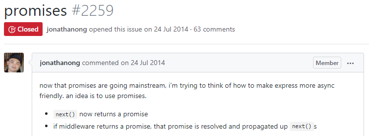
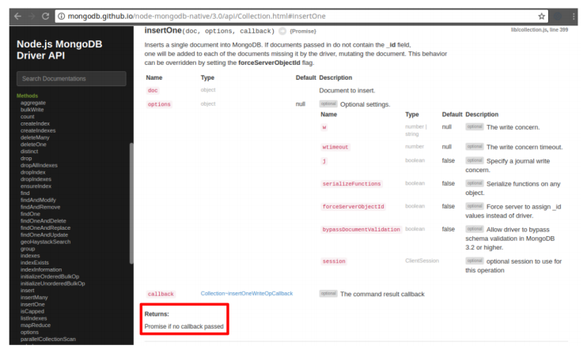

# 4. 현업에서의 Async/Await

async/await는 그 자체로 매우 강력한 도구입니다. 하지만 진정으로 빛을 발하는 때는 자바스크립트 오픈소스 생태계와 연계될 때입니다. 2005년 경, 자바스크립트를 작업 용으로 사용하다는 것이 고통스러운 일이었다는 것은 비밀도 아닙니다. 하지만 그 고통이 개발자들로 하여금 믿을 수 없이 다양한 라이브러리와 대부분의 문제들을 처리할 프레임워크를 구축하도록 이끌었습니다.

자바스크립트가 async/await 같은 특징들을 갖추었기에 이들 라이브러리들과 프레임워크들이 더욱 강력해 졌습니다. 이번 장에서는 async/awsit가 몇몇 공통 npm 패키지들과 어떻게 상호작용 하는지 살펴보겠습니다. 또한 npm 패키지가 async/await와 잘 동작하는지 평가하는 방법도 배워봅시다.

대체로, npm 패키지가 async/await와 통합을 이룰 때는 라이브러리와 프레임워크 두 가지 범주 중 하나에 속하게 됩니다.

* 보통, express나 redux 같은 프레임워크로 작업할 때는, 그 프레임워크에 여러분의 함수들을 전달하면 프레임워크가 여려분을 위해 호출을 처리합니다.
* 반대로, superagent 또는 MongoDB 드라이버 같은 라이브러리는 여러분이 직접 호출 처리를 해야할 함수들의 집합을 제공합니다.

모든 npm 패키지들이 이 범주에 명확히 포함되는 것은 아닙니다. 하지만 주어진 패키지가 async/await와 잘 작동하는가에 대한 질문을 두 개의 더 쉬운 질문으로 나누는데 도움을 줍니다.

프레임워크가 async/await를 지원한다고 했을때, 프레임워크는 promise를 반환하는 함수들을 지원해야 합니다.

```jsx
// example 4.1

// Express는 node.js를 위한 가장 유명한 웹 프레임워크입니다.
const app = require("express")();

// Express는 promise를 반환하는 함수들을 처리할 수 있나요?
app.get("*", async function (req, res) {
  await new Promise((resolve) => setTimeout(resolve, 1000));
  res.send("Hello, World!");
});
```

Async/await를 지원하는 라이브러리가 제공하는 함수들은 thenables을 반환해야 합니다.

```jsx
// example 4.2

// superagent는 node.js를 위한 가장 유명한 HTTP client 라이브러리입니다.
const superagent = require("superagent");
run().catch((error) => console.error(error.stack));

async function run() {
  // superagent가 제공하는 get()는 thenables를 반환하나요? 
  const response = await superagent.get("http://google.com");
}
```

이젠 이러한 원리들을 몇 가지 유명한 npm 패키지들에 적용해 볼텐데. 테스트 프레임워크인 mocha를 먼저 살펴봅시다.

## With Mocha

Mocha는 프레임워크 범주에 속합니다. 행동-중심-개발\(BDD\) 테스트를 수행하는 프레임워크입니다. 아래 예는 Mocha 홈페이지에서 가져온 것입니다. 자바스크립트의 내장 함수인 `indexOf()`가 단순한 케이스 하나를 정확하게 처리한다고 주장하는 하나의 테스트가 있습니다.

```jsx
// example 4.3

const assert = require("assert");

describe("Array", function () {
  describe("#indexOf()", function () {
    it("should return -1 when the value is not present", function () {
      assert.equal([1, 2, 3].indexOf(4), -1);
    });
  });
});
```

`describe()` 호출들은 JUnit와 같은 더 오래된 테스트 프레임워크에서 나오는 시험 케이스들과 유사하며, `it()` 호출들은 개별 시험들입니다. 그래서 Mocha의 async/await 지원은 `it()` 함수가 promise를 반환하는 함수를 인수로 받아드릴 수 있는 가지에 달려 있습니다.

Mocha가 promise를 지원하는지 알아보려면 [promise에 대한 섹션](https://mochajs.org/#working-with-promises)이 있는 아래의 문서 사이트를 방문해 보세요.

보는 바와 같이, Mocha는 프레이워크로서 async/await를 지원합니다. 좀 더 깊이 살펴보면, Mocha는 2014년 3월 v1.8.0 이후, 기본적으로 promise를 지원해 왔습니다.

아래는 async/await와 함께 Mocha를 사용한 사례입니다.

```jsx
// example 4.4

describe("async", function () {
  it("works", async function () {
    assert.equal(await Promise.resolve(42), 42);
  });
});
```

## With Express

Express는 RESTful API와 고전적인 웹 애플리케이션과 같은 HTTP 서버를 구축할 때 이용하는 Node.js용 웹 프레임워크입니다. 중요한 점은 Express가 기본적으로 프레임워크라는 것인데, 이는 Express의 async/await 지원이 promise를 반환하는 함수들을 지원한다는 것에 기원합니다. 다음은 동기식 함수와 함께 Express를 사용하는 방법을 보여주는 사례입니다.

```jsx
// example 4.5

const app = require('express')(); 

app.get('*', (req, res) => res.send('Hello, World!')); 

const server = app.listen(3000);
```

Mocha가 바로 async/await를 지원하기 때문에 Express도 async/await를 지원한다고 실수로 생각할 수 있습니다. 실수가 맞습니다. 하지만, Express의 라우트 핸들러 함수들이 비동기임에도 불구하고, 아래의 코드는 잘 작동했하기 때문에, 하기 쉬운 실수입니다.

```jsx
// example 4.6

const app = require('express')();

app.get('*', async (req, res) => res.send('Hello, World!')); 

const server = app.listen(3000);
```

Express가 async/await를 완벽하게 지원하지 않는다는 것을 알아내기란 좀 어렵습니다. 왜냐하면 문서에서 어떤 식으로든 명시적으로 언급하고 있지 않기 때문입니다. 만약 구글에서 "express async/await"을 검색하면, promise는 지원하지 않는 듯 하다는 것을 암시하는 오래된 GitHub 이슈를 만나게 됩니다.



불행히도, 이 GitHub 이슈는 Express와 async/await 간의 상호 작용이 어디에서 문제 인지에 관해 분명하지 않습니다. 문제는 비동기 함수가 오류를 발생 시킬 때 나타나는 현상입니다.

```jsx
// example 4.7

const app = require("express")(); 

// 프로그램은 오류가 나서 HTTP response도 보내지 않는 상황입니다.
app.get("*", async () => {
  throw Error("Oops!");
});

const server = app.listen(3000); 

// 이번 GET request는 오류도 'Oops!' error로 발생하지 않습니다.
const request = superagent.get("http://localhost:3000").end();
```

Node.js의 구형 버전에서는 위의 superagent 요청이 중단됩니다. 최신 버전에서는 Express가 promise의 오류를 **처리하지 않기** 때문에 Express 서버 프로세스가 강제 종료됩니다.

불행히도 Express 자체를 뜯어 고치거나 wrapper 함수를 사용하지 않고서는 Express가 promise를 적절하게 처리할 방법은 없습니다. wrapper 함수를 사용하는 것이 좀 더 나은 선택인데, 왜냐하면 프레임워크 코드의 일부를 수정할 때 발생할 수 있는 모든 잠재적 결과를 예측하기 어렵기 때문입니다. 다음은 Express에서 비동기 함수의 오류를 처리하는 데 활용할 수 있는 wrapper 함수의 사레입니다.

```jsx
// example 4.8

app.get("*", wrap(async () => {
    throw Error("Oops!");
  })
);

const server = app.listen(3000);

try {
  await superagent.get("http://localhost:3000");
} catch (error) {
  // error.response.text === 'Oops!'
}

function wrap(fn) {
  return (req, res) =>
    fn(req, res).catch((error) => {
      if (res.headersSent) {
        // `headersSent` means Express has already started sending
        // an HTTP response, so we can't report the error via the
        // HTTP response. Depending on your app's needs, you may
        // choose to rethrow the error here, or ignore it.
        return;
      } 
      // Error occurred, set the response status to 500 (Internal
      // Server Error) and send the error message.
      res.status(500).send(error.message);
    });
}
```

오류 처리에서 async/await 통합 문제가 발생하는 경우가 많습니다. 사용하는 프레임워크가 async 함수에서 발생한 오류를 올바르게 처리하는지 확인해야 합니다. 얼핏 async 함수를 지원하는 것처럼 보이지만 오류를 제대로 처리하지 않는 프레임워크는 Express 뿐 만 아닙니다.

## With MongoDB

Mocha는 async 함수를 완전히 지원하는 프레임워크의 예이며 Express는 async 함수를 지원하지 못하는 프레임워크의 예입니다. 이젠 node.js 라이브러리의 한 사례를 살펴봅시다: MongoDB 공식 드라이버

일반적으로 MongoDB 드라이버는 콜백 같은 몇 가지 예외를 제외하고는 여러분을 위해 함수들을 실행하지 않습니다. MongoDB 드라이버를 기반으로 구축된 앱은 주로 CRUD\(생성, 읽기, 업데이트, 삭제 작업 들\) 수행을 위해 드라이버가 제공하는 함수들을 사용합니다.

```jsx
// example 4.9

const { MongoClient } = require("mongodb");
const uri = "mongodb://localhost:27017/test";
const client = await MongoClient.connect(uri);
const db = client.db("test");

await db.collection("test").insertOne({ answer: 42 }); // Create

const doc = await db.collection("test").findOne(); // Read

console.log(doc.answer); // Prints "42"
```

라이브러리가 async/await를 지원하기 위해서는 라이브러리 함수들은 thenables를 반환해야 합니다. 문서에는 라이브러리 함수에 콜백을 명시하지 않는 한, insertOne\(\) 같은 함수들은 promise를 반환한다고 적혀있습니다.



이것은 mongoDB 드라이버가 라이브러리 관점에서 async/await를 지원한다는 것을 의미합니다. 그러나 async/await와 MongoDB 드라이버를 사용한다는 것은 여러분이 개별 CRUD 연산들에 단순히 `await` 이상을 수행하도록 합니다. async/await은 loop를 사용한 데이터 스트리밍에 대한 아주 명쾌한 대안들을 내놓고 있습니다.

대부분의 데이터베이스 앱들은 데이터베이스로부터 한번에 몇 개의 문서들을 읽어 들입니다. 하지만 앱이 활용할 수 있는 메모리 용량을 넘어서는 수백만 개의 문서를 읽어 들여야 한다면 어떤 일이 발생할까요? MongoDB 드라이버는 커서\(cursor\)라는 구조를 가지고 있는데, 이것은 일정 수의 문서들을 한번에 조금씩 메모리에 올리면서 방대한 데이터를 반복적으로 가져올 수 있습니다.

MongoDB 커서는 `next()` 함수를 가지는 객체입니다. 기본적으로 이 함수는 다음 문서나 문서가 없다면 `null` 값을 해결값으로 가지는 promise를 반환합니다. Async/await가 없었다면, next\(\)를 사용하는 커서를 통한 데이터의 반복적 획득은 재귀호출을 사용해야 합니다. 하지만 Async/await 덕분에 한 번의 for 반복문을 사용하는 커서로 데이터를 획득할 수 있습니다.

```jsx
// example 4.10

await db.collection("Movie").insertMany([
  { title: "Star Wars", year: 1977 },
  { title: "The Empire Strikes Back", year: 1980 },
  { title: "Return of the Jedi", year: 1983 },
]);

// find()는 커서를 반환합니다. 여기에 await은 하지 마세요.
const cursor = db.collection("Movie").find();

for (let v = await cursor.next(); v != null; v = await cursor.next()) {
  console.log(v.year); // Prints "1977", "1980", "1983"
}
```

그렇습니다. 여러분은 `for` 반복문 내부에서 `await`를 수행할 수 있습니다. 이런 패턴이 좀 더 직관적이며 재귀나 스트림 이용보다 커서를 통한 반복적 접근이 성능 기준에 맞는 방법입니다.

## With Redux

React는 가장 유명한 자바스크립트 UI 프레임워크입니다. 그리고 Redux는 React를 위한 가장 유명한 상태 관리 프레임워크입니다. 2015년에 Redux가 발표된 이후로, 이 둘은 대체로 동의어가 되어 버렸습니다. Async/await 통합의 목적 상 이 둘은 모두 프레임워크에 해당됩니다.

우선 Redux가 어떻게 async/await와 통합되는지 알아봅시다. 아래는 nodejs에서 동기 함수들과 함께 Redux를 사용하는 사례입니다. Redux는 3개의 주요 기본 개념을 가지고 있습니다: stores, actions, reducers. _**store**_는 여러분 앱의 상태를 추적합니다. _**action**_은 시스템에 걸친 어떤 변화를 표현한 객체입니다. 그리고 _**reducer**_는 action에 대한 반응으로 앱의 상태 객체를 수정하는 동기 함수입니다.

```jsx
// example 4.11

// _store_는 상태를 추적하고 _actions_을 여러분이 처리토록 합니다. 
const { createStore } = require("redux");

// _reducer_는 상태를 바꾸는 동기 함수입니다.
// Redux는 action 마다 reducer를 호출합니다.
const reducer = (state, action) => {
  switch (action.type ) 
  {
    case "INCREMENT":
      return state + 1;
    case "DECREMENT":
      return state - 1;
    default:
      return state;
  }
};

// 신규 store를 생성하고 상태변화를 수신할 모니터를 등록합니다.
const store = createStore(reducer, 0);
store.subscribe(() => console.log(store.getState()));
store.dispatch({ type: "INCREMENT" }); // Prints "1"
store.dispatch({ type: "INCREMENT" }); // Prints "2"
store.dispatch({ type: "DECREMENT" }); // Prints "1"
```

Redux 초보자가 혼란스러워 하는 점은 할당 연산자를 사용해서 상태를 직접적으로 수정하는 대신에 왜 dispatch\(\) 함수에 action 객체를 전달해서 상태를 수정해야 하는가 입니다. 자바스크립트에서 value가 수정되는지 감시하는 것은 어려운 일입니다. 그래서 전 시스템에 걸쳐 모든 변화를 관찰하기 쉽도록 action이 존재하는 것입니다. 특히, Redux 덕분에 상태가 변할 때 마다 React UI를 업데이트하기 쉬워졌습니다.

그렇다면 Redux는 async/await를 사용할 수 있을까요? Redux reducer는 동기적 _**이어야만**_ 합니다. 따라서 async 함수를 reducer로 사용할 수 없습니다. 하지만, async 함수에서 action들을 dispatch 할 수 있습니다.

```jsx
// example 4.12

store.subscribe(() => console.log(store.getState()));

run().catch((error) => console.log(error.stack));

async function run() {
  store.dispatch({ type: "INCREMENT" }); // Prints "1"
  await new Promise((resolve) => setImmediate(resolve));
  store.dispatch({ type: "INCREMENT" }); // Prints "2"
}
```

async 함수에서 store.dispatch\(\) 호출은 잘 작동하지만, Redux의 기본 방침을 따르는 것은 아닙니다. 공식적인 Redux 식 접근법은 redux-thunk 패키지와 action 생성자를 활용하는 것입니다. action 생성자는 단일 인수\(dispatch\)를 가진 함수를 반환하는 함수입니다.

```jsx
// example 4.13

const { createStore, applyMiddleware } = require("redux");
const thunk = require("redux-thunk").default;

// The 3rd arg to `createStore()` is composed Redux _middleware_
const store = createStore(reducer, 0, applyMiddleware(thunk));
store.subscribe(() => console.log(store.getState()));

// `redux-thunk` lets you dispatch _action creators_, which are
// potentially async functions that can `dispatch()` more actions
store.dispatch(async (dispatch) => {
  dispatch({ type: "INCREMENT" }); // Prints "1"
  await new Promise((resolve) => setImmediate(resolve));
  dispatch({ type: "INCREMENT" }); // Prints "2"
});
```

redux-thunk의 목적은 제어의 역행입니다. 다른 말로, dispatch\(\)를 받는 action 생성자는 단일 Redux store에 강제로 종속되지 않습니다. AngularJS의 의존성-입과 같지만 React에서는 아닙니다.

## With React

Redux는 자바스크립트의 가장 인기 있는 UI 프레임워크인 React와 가장 잘 어울립니다. 비대해지는 것을 피하기 위해, 이 장은 React의 선호되는 확장 JS 구문인 JSX를 사용하지 않겠습니다. 아래는 "Hello, World!"를 보여주는 컴포넌트를 만드는 사례입니다.

```jsx
// example 4.14

const { renderToString } = require("react-dom/server");
const { createElement, Component } = require("react");

class MyComponent extends Component {
  render() {
    return createElement("h1", null, "Hello, World!");
  }
}

// <h1 data-reactroot="">Hello, World!</h1>
console.log(renderToString(createElement(MyComponent)));
```

현재, `render()`함수들은 async 가 될 수 없습니다. async `render()`를 사용하면 React는 "Objects are not valid as React child" 오류를 냅니다. 하지만 앞으로 나올 React의 미정의 API에서 바뀔 수도 있습니다.

React 컴포넌트에는 lifecycle hooks이 있는데, 컴포넌트와 상호작동할 때 React가 호출합니다. 예를 들어, React는 컴포넌트가 DOM에 더해지기 전에 `componentWillMount()`를 호출합니다. 아래 코드는 "Hello, World!"를 보여주는 HTML을 생성합니다. 첫 render\(\) 호출 전에 `componentWillMount()`가 먼저 수행되기 때문입니다.

```jsx
// example 4.15

class MyComponent extends Component {
  componentWillMount() {
    this.setState({ v: "Hello, World!" });
  }
  render() {
    return createElement("h1", null, this.state.v);
  }
}

// <h1 data-reactroot="">Hello, World!</h1>
console.log(renderToString(createElement(MyComponent)));
```

The `componentWillMount()Hook`은 async 함수를 다루지 않습니다. 아래 코드는 비어있는 문서를 생성합니다.

```jsx
// example 4.16

class MyComponent extends Component {
  async componentWillMount() {
    this.setState({ text: null });
    await new Promise((resolve) => setImmediate(resolve));
    this.setState({ text: "Hello, World!" });
  }
  render() {
    return createElement("h1", null, this.state.text);
  }
}

// <h1 data-reactroot=""></h1>
console.log(renderToString(createElement(MyComponent)));
```

또한 React는 async `componentWillMount()`에서 발생하는 오류를 처리하지도 않습니다.

```jsx
// example 4.17

class MyComponent extends Component {
  async componentWillMount() {
    this.setState({ text: null });
    await new Promise((resolve) => setImmediate(resolve));
    
    // Unhandled promise rejection
    throw Error("Oops");
  }
  render() {
    return createElement("h1", null, this.state.text);
  }
}

// <h1 data-reactroot=""></h1>
console.log(renderToString(createElement(MyComponent)));
```

보통, React는 async 함수를 잘 다루지 않습니다. async `componentWillMount()`가 브라우저에서 수행되기는 하지만 오류를 처리하지도, `.catch()`로 들어갈 방법도 없습니다.

```jsx
// example 4.18

const reducer = (state, action) => Object.assign({}, state, action);
const store = createStore(reducer, { v: "" }, applyMiddleware(thunk));

class MyComponent extends Component {
  componentWillMount() {
    this.setState(store.getState());
  }
  render() {
    return createElement("h1", null, this.state.v);
  }
}

store.dispatch(async (dispatch) => {
  await new Promise((resolve) => setTimeout(resolve, 250));
  dispatch({ type: "SET", v: "Hello, World!" });
});

setInterval(() => {
  // First 2 will print an empty <h1>, then "Hello, World!"
  console.log(renderToString(createElement(MyComponent)));
}, 100);
```

불행히도, `redux-thunk`는 async action 생성자에서 발생한, 오류를 처리하지 못합니다. 하지만 action 생성자는 class 메서드와 반대되는 함수이기 때문에 example 4.8과 같은 wrapper 함수를 이용해서 오류를 처리할 수 있습니다. React, Redux를 위해, Wrapper 함수는 여러분의 UI가 처리할 수 있도록 오류 action을 `dispatch()`로 처리해야만 합니다.

```jsx
// example 4.19

const wrap = (fn) => (dispatch) => {
  fn(dispatch).catch((error) => dispatch({ type: "ERROR", error }));
};

store.dispatch(
  wrap(async (dispatch) => {
    await new Promise((resolve) => setTimeout(resolve, 250));
    dispatch({ type: "SET", v: "Hello, World!" });
  })
);
```

React, Redux, Express 같이 async/await의 좋은 지원이 부족한 프레임워크를 위해서는 wrapper 함수 이용해서 프레임워크와 어울리는 방식으로 오류들 을 처리해야 합니다. async/await를 지원하기 위해 프레임워크에 강제적 수정을 가하는 플러그인들은 경계해야 합니다. 하지만 무엇보다도, 모든 프레임워크가 여러분을 위해 오류들을 처리하는 것은 아니기 때문에 여러분이 직접 async 함수에서 발생하는 오류 들을 다뤄야만 한다는 점은 분명합니다.

## Exercise 1: X가 async/await를 지원하나요?

Agenda는 특정 시간에 수행되는 작업을 스케쥴로 만들어 주는 npm 모듈입니다. 아래는 Agenda의 `schedule()`를 설명한 문서입니다. `schedule()` 는 라이브러리 관점에서 async/await을 지원할까요?

### **`schedule(when, name, [data], [cb])`**

`주어진 시간에 name 이름의 작업을 한번 수행하는 스케쥴을 만듭니다.`

`when은 Date 또는 tomorrow at 5pm 같이 String 타입이 될 수 있습니다.`

`data는 job.attrs.data로 함수에 전달되는 선택적 파라미터 입니다.`

`cb는 작업이 database에 머물러 있을 때 호출되는 선택적 콜백 함수입니다.`

`job을 반환합니다.`

```jsx
agenda.schedule('tomorrow at noon', 'printAnalyticsReport', {
 userCount: 100
});
```

모든 메서드가 그렇듯이 name은 job name들의 배열이 될 수도 있습니다.

```jsx
agenda.schedule('tomorrow at noon', [
 'printAnalyticsReport',
 'sendNotifications',
 'updateUserRecords'
]);
```

이 경우, `schedule`은 `jobs` 배열을 반환합니다.

## Exercise 2: WebSocket Integration

WebSockets은 브라우저와 서버 사이에 실시간 커뮤니케이션을 위한 도구입니다. WebSockets이 없다면, 브라우저가 서버로 먼저 HTTP request를 하지 않는 한 서버가 브라우저로 데이터를 전송할 수 없습니다. WebSockets 연결을 통해, 서버는 브라우저로 데이터를 push할 수 있습니다.

WebSockets 통합의 핵심 함수는 onmessage\(\)이며 socket에 처리해야 할 새로운 데이터가 있을 때 자바스크립트가 호출합니다.

```jsx
const ws = new WebSocket('wss://echo.websocket.org/');
ws.onmessage = e => console.log('Got', e.data);
```

자바스크립트는 `onmessage`가 async라면 `onmessage` 내부에서 발생한 오류를 처리하지 못합니다.

async `onmmessage()`를 감싸는 \(wrapper\)함수를 작성하세요. 이 때 내부에서 발생하는 오류들은 콜솔로 출력하세요.

다음은 초기 코드입니다. 비록 node.js가 WebSockets을 갖지 못해서 유사한 ws npm 모듈이 필요하겠지만, 이것을 복사해서 node.js로 예제를 풀어보세요.

```jsx
// Implement this function
function wrap(onmessage) {
 console.log('Not implemented')
}

// Do not modify the below code
const ws = new WebSocket('wss://echo.websocket.org/');

ws.onmessage = wrap(async function(e) {
 throw Error('Congratulations, you completed this exercise!');
});

ws.onopen = () => ws.send('Hello, World');
ws.onclose = () => console.log('disconnected');
```

